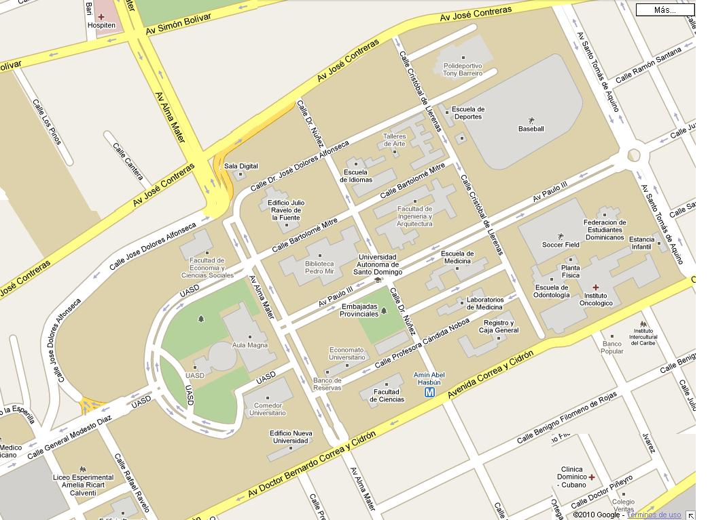
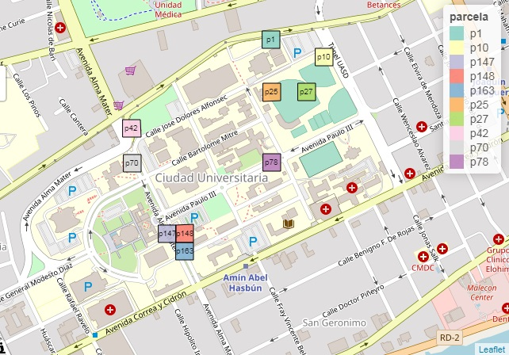
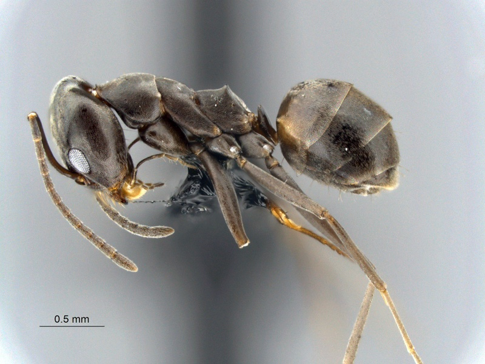
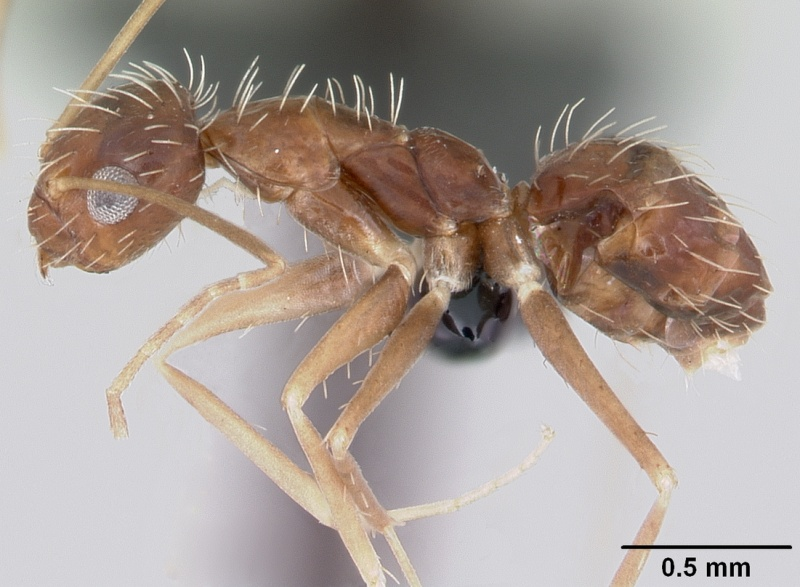
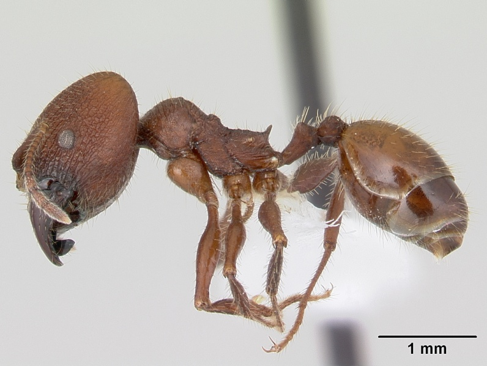
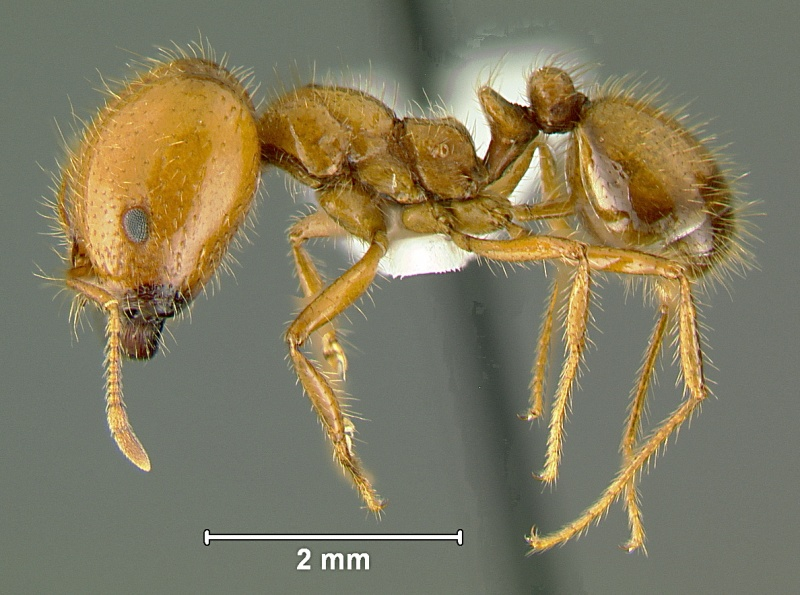

# Introducción

Las hormigas juegan un rol muy importante en el desarrollo de los ambientes urbanos, estas pueden afectar de manera directa o indirecta a muchos de lo seres vivos, como plantas y animales. Estas afecciones pueden ser picaduras o mordeduras estas introduccen ácido fórmico en el cuerpo de algunos animales causandole alergia. También dañan edificaciones, alimentos, jardines y algunas pueden ser vectores de agentes infecciosos [@klotz2008urban; @robinson1996urban; @robinson2005urban].

Las hormigas pertenecen al reino Animalia, filo Arthropoda, clase Insecta, orden Hymenoptera y se distinguen de los demas animales por por pertener a una única familia Formicidae. Se conocen alrededor de 12,000 a 20,000 especies de hormigas en el mundo, estas son clasificadas en subfamilias [@chacon2008aspectos]. En la hispaniola existen  43 géneros y 147 especies [@AntWiki].

Las hormigas son seres vivos muy peculiares y apesar de esto se reunen en grupos de especies a los cuales se le llaman gremios, cada gremio comparten similitudes diferentes, como aspectos de su biología, preferencia de hábitats y nichos; ejemplo de un gremio que ocupa de forma exclusiva un nicho son las cultivadoras de hongos, todas las hormigas de la tribu Attini [@chacon2008aspectos].

En esta investigación tomamos en cuenta la Ecología de nidos en la Universidad Autonoma de Santo Dominingo. El nido es la parte fundamental de la sociedad de hormigas. Cerca del 80-90% de los miembros de una colonia pertenecen en el nido [@petal1978role]. La arquitectura de los nidos es muy variada, todo depende las especies que habiten en el nido. Existen generos de hormigas que habitan ante todo en el suelo, hojarasca, troncos o incluso en otros animales, por ejemplo Wasmannia auropunctata y Paratrechina fulva [@armbrecht2003little, @zenner1990biological].

La ubicación de los nidos depende de los factores ambientales como temperatura y humedad, también depende de la facilidad de reclutamiento de alimentos para poder sobrevivir y reproducirse exitosamente @bernstein1979partitioning. 

Los nidos de hormigas y su modo de distribución en el espacio nos dan información complementaría en el estudio de la comunidad en si. Por esa razón para realizar esta investigación se tomaron en cuenta las siguientes preguntas:

1- ¿Cuál es la distribución espacial entre los nidos edificado y pavimentado que superan los 5 metros de distancia?

2- ¿Influye el transito de humanos en la diversidad de hormigas?

3- ¿Existe diferencia significativa en la densidad de nidos entre distintos sustratos?

4- ¿Qué tanto recambio de especies existe entre nidos de sustratos herbáceos o áreas contruidas?

# Metodología

*Área de Estudio*

El trabajo se realizó en el campo de la Universidad Autonoma de Santo Domingo (UASD) (18 27 40 N, 69 55 02 W). Tiene un área aproximada de 375, 000 m. Limita al norte con la Av. José Contreras, al sur con la Av. Correa y Cidrón, al este con la Av. Santo Tomás de Aquino, y al oeste con la calle General Modesto Diaz. Posee una temperatura promedio anual de 25.7 C. Eligimos está área porque tiene un fácil acceso y por poseer diferentes tipos de sustratos o coberturas como herbaceos, dosel, construido, edificados, no edificado ni cubierto, entre otros. Además en esta área existe una gran diversidad de hormigas.

*Materiales y métodos*

[Se seleccionarion un total de 10 parcelas establecidas para el campo de la UASD con diferentes tipos de coberturas, construido, mobiliario, suelo, herbáceos, no edificado ni cubierto. Los muestreos fueron realizados desde el día 12 al 26 de octubre del año 2019.

Entre los materiales que utilizamos estan: frascos plásticos, alcohol etílico al 80%, pinceles de cerdas claras, papel vegetal para las etiquetas, chinográfo para escribir, dispositivo Android para llenar los formulario de ODK Collect. ODK es un conjuntos de herramientas de código libre que crea formularios para poder recoger los datos en un dispositivo móvil y enviarlos a un servido.

Como se menciono anteriormente esta investigación se basó en la ecología de nidos. Para realizar la coleccón de datos se hizo un censo detallado de nido en cada parcela, tomando datos dentro de la cobertura que le corresponde a la parcela elegida. Luego se toman las coordenas de cada nido, información ambiental y relación de flora asociada al nido. 

En cada nido se colecto de 5 a 8 individuos, para hacerlo utilizamos un pincel humedicido con alcohol etílico al 80%, luego cada individuo de un mismo nido se deposito en un mismo frasco, es decir. Se utilizo un frasco por nido el cual estaba debidamente etiquetado en papel vegetal el nombre del colector, fecha y hora, el número de la parcela y la muestra (p#m#). El trabajo de campo fue realizado por dos personas, una relleno el formulario de ODK y la otra colecto las hormigas. Por último pero no menos importante, los formularios fueron enviados a un servidor para ser evaluados.

Culminado con la recolección de datos del campo, el siguiente paso fue realizar la identificación de cada individuo encontrado en cada nido. Para esto se utilizo una lupa de modelo AmScope 3.5X-180X Inspection Zoom Stereo Microscope +144-LED Light, pinzas, porta objetos, alcohol al 80%, guía de identificación hasta género de hormigas utilizando la guía de AntWiki y llenar los formularios para identificación de ODK.]

# Resultados

 

![Distancia a basura. Este mapa nos muestra la distancia a basura que estan los nidos de cada parcela. Los nidos que menos distantes esten de basura tienen mas diversidad, esto se debe a que pueden conseguir mas facil sus alimentos, entre otras cosas; por ejemplo en la parcela p42 la distancia a basura de los dos nidos encontrados fue de 1a5, por ende esta parcela tiene una diversidad moderada ya que se encontraron dos géneros diferente. Sin embargo, la parcela p78 no tuvo basura a la vista, por ende tiene una poca diversida ya que solo se encontro un solo género.](distancia a basura.jpg) 

![Distancia a agua. Este mapa nos muestra la distancia a agua. El agua es indispensable para la mayoría de los seres vivos y las hormigas no son la excepción, pero sabemos que sus refugios son lejos del agua o si llueven encuentran un lugar seguro donde no esten expuestas. Por esta razón, en este estudio solo se encontraron dos parcela cerca de agua fue la p1 Y p10; los nidos encontrados en estas parcelas algunos no tenía agua a la vista y otros a una distancia de 6a9. Sin embargo, estas parcela tenían una diversidad alta, por ejemplo en la parcela p1 se encontraron dos géneros distintos y en la p10 3 géneros distintos.](distanciaagua.jpg)

![Mapa de sustrato. Este mapa nos muestra los diferentes sustratos que se estudiaron. El sustrato es una variable fundamental en la diversidad de individuos, ya que cada especie tiene su hábitat específico para desarrollarse con exito, sin embargo existen sustrato con mayor diversidad que otros, ya sea por tener mejor tasa de alimentos y ser menos propensos a perturbaciones. Es común que los suelos herbacios, no edificados ni cubiertos esten mas poblado que otros sustrato. Por ejemplo las parcelas p10 y p25 tiene el sustrato mencionado anteriormente y en estas parcelas existe una mayor diversidad de género que en los demás sustratos. ](sustrato.jpg)

]

#Discusión

Es importante destacar que existe una amplia diferencia entre las parcelas situadas en edicaciones y las situadas en pavimentado; En los bordes de las edificaciones se encontraron muy pocos nidos, sin embargo, en las grietas del suelo pavimentado era muy común encontrar varios nidos, y más común si cerca existía un deposito de basura, además los nidos encontrados en pavimento superar una distancia de 5 metros de los nidos encontrados en edificaciones que casi nunca existía deposito de basura cerca. Dicho esto, se puede concluir que las parcelas que cuentan con almacenamiento de basura cerca de este es posible encontrar nidos y en su gran mayoría la parcela puede tener una gran diversidad de individuos.

El transito de humanos o la distancia a vías son uno de los factores que mas influye en la diversidad de las hormigas. Por ejemplo en este estudio las parcelas que mas alejadas estuvieron de las vías o del flujo de personas se encontraron más nidos, ya que están menos propensas a perturbaciones y pueden andar en su hábitat libremente (ir a la figura 8).

El sustrato es otro de los factores indispensable al momento de estudiar hormigas, el tipo de sustrato puede decirnos rapidamente la heterogeniedad que existe en una área. Como ejemplo de esto tenemos el sustrato tipo herbáceos, en este estudio fue en el que más nidos se encontro y el que mayor diversidad de individuos represento. En pocas palabras los suelos herbácios presentan una densidad mayor que el sustrato pavimentado o edificado. Es importante destacar que no existe un gran recambio de especie según el sustrato, esto fue demostrado ya que se encontraron géneros iguales en sustratos diferentes.

En este trabajo uno de los géneros más encontrado en los nidos fueron las especies del género Pheidole, presente en 5 parcelas, siguiendole a esta las especies del género Solenopsis presentes en 6 parcelas. En un estudio realizado en México la especie más encontrada fue del género Pheidole con un total de 51 individuos, presente en diferentes sustratos [@fernandez2001hormigas].

]

# Agradecimientos

Al profesor José Ramón Martinez Batlle, por impartir esta asignatura y brindarnos su apoyo incondicional para mí aprendizaje y el de mis compañeros.

A mi compañero Enrique García, por ayudarme en la colecta de hormihgas.

# Referencias
